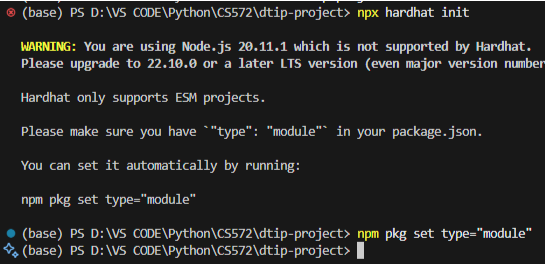
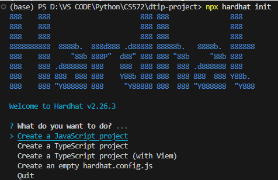
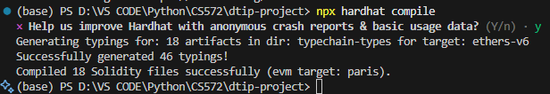
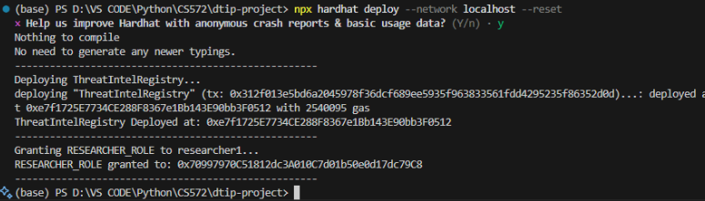
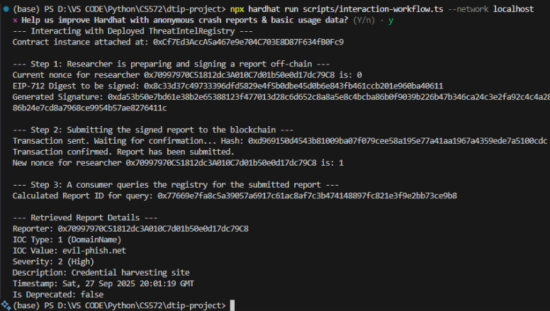

# Decentralized Threat Intelligence Platform (DTIP)

## Table of Contents

- [Abstract](#abstract)
- [Overview](#overview)
- [System Architecture](#system-architecture)
- [Smart Contracts](#smart-contracts)
- [Workflow Visualization](#workflow-visualization)
- [Participant Roles](#participant-roles)
- [Tokenomics Model (inferred from contract structure)](#tokenomics-model-inferred-from-contract-structure)
- [Tech Stack](#tech-stack)
- [Local Setup & Quick Start](#local-setup-and-quick-start)

## Abstract

Traditional centralized threat intelligence systems are vulnerable to single points of failure, censorship, and legal coercion. DTIP is a blockchain-based solution built on Ethereum that establishes an immutable, censorship-resistant ledger for Indicators of Compromise (IOCs). By leveraging smart contracts and a "Contribute-to-Earn" tokenomic model, DTIP incentivizes high-quality threat reporting while democratizing access to critical security data.

## Overview

- **Project:** Decentralized Threat Intelligence Platform (DTIP)
- **Purpose:** A blockchain-based registry for sharing, purchasing, and rewarding threat intelligence. Researchers publish intelligence entries; Consumers pay to access high-value data; Administrators manage the platform and take a platform commission. Access control is implemented with OpenZeppelin's `AccessControl`.

## System Architecture

- **Smart Contracts:** Located in `contracts/` with the main contract `ThreatIntelRegistry.sol` and OpenZeppelin `AccessControl.sol` used for role management. Compiled artifacts are available in `artifacts/` and TypeScript bindings under `typechain-types/`.
- **Backend / Scripts:** Deployment and interactions are scripted in `deploy/` and `scripts/` (for example, `deploy/01-deploy-threat-intel-registry.ts` and `scripts/interaction-workflow.ts`).
- **Tests:** Unit tests are under `test/` (e.g., `ThreatIntelRegistry.test.ts`).
- **Tooling:** Built with Hardhat (`hardhat.config.ts`). Use `npm` to install dependencies and `npx hardhat` to run tests and scripts.

## Smart Contracts

1. **AccessControl.sol:** _Manages permissions and governance_

- **Administrator:** Vets researchers and manages the trusted list.
- **Researcher**: Verified entities authorized to submit signed threat data.
- **Consumer**: Public users (SIEMs, Firewalls) who query the read-only data.

2. **ThreatIntelRegistry.sol:** _The core logic contract._

- Handles the submission of IOCs (IPs, Domains, File Hashes).
- Verifies cryptographic signatures off-chain (ecrecover) to save gas.
- Mints reward tokens for valid submissions.

## Workflow Visualization

- **Phase 1 (Vetting):** Admin vets Candidate → On-Chain Role Granted → Candidate Stakes Tokens.
- **Phase 2 (Submission):** Researcher signs data off-chain → Submits to Contract → Contract Verifies & Stores → Tokens Rewarded.
- **Phase 3 (Defense):** Consumer calculates hash locally → Queries Contract (Gasless) → Automates Defense blocks.

## Participant Roles

- **Admin (Governance / Platform Owner):**
  - Managed by the `DEFAULT_ADMIN_ROLE` or a similar admin role provided by `AccessControl`.
  - Responsibilities: grant/revoke roles, set or change platform-level parameters (platform fee, accepted currency, payout addresses), withdraw platform commissions, deploy and upgrade contracts (as permitted).
  - Privileges: administrative functions in `ThreatIntelRegistry.sol` such as `setPlatformFee`, `withdrawPlatformRevenue`, `grantRole`/`revokeRole`.
- **Researcher (Data Provider):**
  - Roleed via `RESEARCHER_ROLE` (or similarly named role) in `AccessControl`.
  - Responsibilities: submit threat intel entries (likely via a function such as `submitIntel` or `publishEntry`), set an access price or pricing rule, optionally stake or register reputation metadata.
  - Rewards: receive payment from Consumers when their entries are purchased; payouts are subject to the platform fee/commission.
- **Consumer (Data Buyer / Analyst):**
  - Interacts with the registry to browse available intelligence and purchase access (likely via a `purchaseAccess` or `buyEntry` function).
  - Pays in the network's native currency (ETH) or an ERC-20 token, depending on the contract implementation.

### Roles Table

| Role            | Responsibility                | Access Level                         |
| --------------- | ----------------------------- | ------------------------------------ |
| `Administrator` | Vetting & Governance          | `DEFAULT_ADMIN_ROLE`                 |
| `Researcher`    | Threat Detection & Submission | `RESEARCHER_ROLE` (Requires Staking) |
| `Consumer`      | Integration & Defense         | Public read access                   |

## Tokenomics Model (inferred from contract structure)

**_Note:_** the precise variable and function names live inside `contracts/ThreatIntelRegistry.sol`. The model below is a clear, practical interpretation of how token flows are typically handled by a registry that uses `AccessControl` and sells intel entries.

- **Currency**: Payments are expected in the chain native currency (ETH) or a configured ERC-20 token. Check the contract constructor or state variables to confirm `acceptedToken` or using `msg.value`.
- **Pricing**: Each intel entry is published by a Researcher with a price (per-entry price). The registry records an entry metadata hash (e.g., IPFS CID or encrypted payload pointer) and an associated price.
- **Purchase Flow & Accounting**:
  - Consumer calls `purchaseAccess(entryId)` and transfers the required funds.
  - Contract holds the payment and credits the Researcher the entry price minus the platform fee, or immediately forwards settlement according to implementation.
  - A platform fee (e.g., specified in basis points or percentage) is deducted automatically. The fee is held in contract-level platform revenue accounting and can be withdrawn by Admin.
- **Revenue Split**:
  - **Researcher payout**: entry price \* (1 - platformFee)
  - **Platform commission**: entry price \* platformFee
  - Example: If platformFee = 10% and consumer pays 1 ETH, Researcher receives 0.9 ETH, platform receives 0.1 ETH.
- **Withdrawals & Escrow**:
  - Researchers or Admin withdraw funds via contract functions like `withdrawRevenue` or `withdrawPlatformRevenue` (names to verify in `ThreatIntelRegistry.sol`).
  - The contract may use a pull-payment model (recommended) to avoid reentrancy: credit balances and require beneficiaries to call `withdraw`.
- **Optional Reputation / Token Incentives** (if present or to be added):
  - The repository does not include a dedicated ERC-20 token contract in the `contracts/` folder. If you want native platform tokens, add an ERC-20 and implement reward minting/distribution for top contributors.
  - Alternatively, the registry can track reputation/points on-chain as a mapping and use that for off-chain incentives or governance voting.

**Security & Access Control**

- `AccessControl` from OpenZeppelin is included; use its role granularity (`DEFAULT_ADMIN_ROLE`, `RESEARCHER_ROLE`) for minimizing privileges.
- Recommended patterns visible in the repo and tests:
  - Use `onlyRole(...)` modifiers for sensitive functions.
  - Use a pull over push payment model to prevent reentrancy.
  - Carefully audit any metadata pointers (IPFS/CIDs) to ensure encryption and access management are off-chain or via encrypted payloads.

**Project File Map (key files)**

- `contracts/ThreatIntelRegistry.sol` : Core registry contract (publish, purchase, payout, fee settings).
- `contracts/AccessControl.sol` : OpenZeppelin access control library present in `artifacts/` and `typechain-types/`.
- `deploy/01-deploy-threat-intel-registry.ts` : Deployment script (parameters such as platform fee, accepted token, admin address are likely configured here).
- `scripts/interaction-workflow.ts` : Example interaction script demonstrating publishing and purchasing flows.
- `test/ThreatIntelRegistry.test.ts` : Unit tests that document expected behaviour and edge cases — consult to confirm exact variable names and flows.
- `typechain-types/` : Generated TypeScript contract types for easier interaction from scripts and frontends.

## Tech Stack

- **Blockchain:** Ethereum (EVM Compatible)
- **Smart Contracts:** Solidity
- **Hashing:** Keccak256
- **Signature Verification:** ECDSA (ecrecover)

## Local Setup & Quick Start

For more details on debugging and setup guide, please refer the detailed guide: [CS572 DTIP WITH SOLIDITY.pdf](CS572%20DTIP%20WITH%20SOLIDITY.pdf)

- **Pre-requisites:** `node` (>=18 recommended), `npm`, `git`, and a local Ethereum node (Hardhat's local network is included).
- **Install dependencies:**

```
cd dtip-project
npm install
```

- **Environment Variables:**

```bash
SEPOLIA_RPC_URL="https://mainnet.infura.io/v3/your_id"
PRIVATE_KEY="your_meta_mask_api_key"
```

- **Compile Contracts:**

```
npx hardhat compile
```

- **Run tests:**

```
npx hardhat test
```

- **Start a local node & deploy** (example):

```
npx hardhat node
npx hardhat run --network localhost deploy/01-deploy-threat-intel-registry.ts
```

- **Interact** (example):

```
npx hardhat run --network localhost scripts/interaction-workflow.ts
```

**How to Verify Tokenomics in Code**

- Open `contracts/ThreatIntelRegistry.sol` and look for these items to confirm numbers and behavior:
  - Platform fee variable (example names: `platformFee`, `feeBasisPoints`)
  - Per-entry price storage (example: `price` field on `Entry` struct)
  - Payment handling (`msg.value`, ERC-20 `transferFrom`, or accounting mappings)
  - Withdrawal functions (`withdraw`, `withdrawPlatformRevenue`)
  - Role checks (`onlyRole(RESEARCHER_ROLE)`, `grantRole`, `revokeRole`)
- Consult `deploy/01-deploy-threat-intel-registry.ts` for the default platform fee and constructor params used at deployment.

**Extending Tokenomics (Suggestions)**

- Add an ERC-20 platform token to enable: staking by Researchers, loyalty rewards for Consumers, governance voting, and discount mechanisms.
- Implement a time-decay pricing model for stale intel or auctions for exclusive, high-value reports.
- Add an on-chain reputation metric to weight payouts or visibility for Researcher submissions.

**Contributing**

- Please open issues or PRs for bugfixes and feature proposals.
- Run and extend unit tests in `test/`.

**Notes & Assumptions**

- This README describes structure and token flows inferred from the presence of `ThreatIntelRegistry.sol` and `AccessControl` in this repo. For exact variable names, percentages, and function signatures, review `contracts/ThreatIntelRegistry.sol`, `deploy/01-deploy-threat-intel-registry.ts`, and `test/ThreatIntelRegistry.test.ts`.
- No ERC-20 token contract was present in `contracts/` at the time of writing. If token-based payments are required, integrate or reference an ERC-20 contract in `contracts/` and update the deployment script.

## Screenshots & Debug

### `npm hardhat init` error



After fix <br>


Success!
After initiating the Hardhat project, we can see the menu of options <br>
Choose ‘Create an empty hardhat.config.js’


### Compile the files



### Start the node

On Terminal 1, run `npm hardhat node` to start the node. <br>


### Deployment

On Terminal 2, run `npx hardhat deploy --network localhost` <br>
In case of failing the test, reset the deployment with `npx hardhat deploy --network localhost  --reset`
 <br>
Then, run this command when done `npx hardhat run scripts/interaction-workflow.ts --network localhost` <br>


### Testing

Command: `npx hardhat test`


The test runs successfully!
